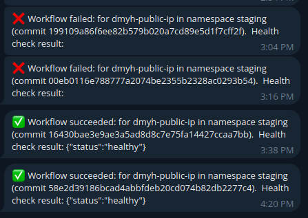

# bigid-dmyh-app

A Flask application that displays the client's IP address, packaged with Docker, deployed via Helm, and integrated with GitHub Actions for CI/CD.

---

## Table of Contents

- [Overview](#overview)
- [Application](#application-apppy)
- [Dockerization](#dockerization-dockerfiletxt)
- [Helm Chart](#helm-chart-charts)
- [CI/CD Workflows](#cicd-workflow-github-actions)
  - [Reusable Workflow](#reusable-workflow-githubworkflowslint-and-testyml)
  - [Pull Request Workflow](#pull-request-workflow-githubworkflowspryml)
  - [Push Workflow](#push-workflow-githubworkflowspushyml)
- [How to Run Locally](#how-to-run-locally)

---

## Overview

`bigid-dmyh-app` is a simple Flask application that:

- Displays the client's IP address.
- Supports user authentication.
- Provides health and readiness endpoints.
- Is packaged as a Docker image.
- Deploys via Helm to Kubernetes.

---

## Application (`app.py`)

### Features

- **Flask Web Server**: Listens on port `5000`.
- **User Management**: Loads `username:password` pairs from `users.txt` (configurable via `USERS_FILE`). Exits if no users are loaded.
- **Authentication**:
  - Protected endpoints using `@auth_required`.
  - `check_auth` validates credentials.
- **Endpoints**:
  - `/` : Returns the client's IP address (prefers `X-Forwarded-For`).
  - `/health` : Returns `status="healthy"` if running longer than `READINESS_TIME`, else `status="not_ready"`.
  - `/ready` : Returns `status="ready"` (HTTP 200) or `status="not_ready"` (HTTP 503) based on `READINESS_TIME`.
- **Readiness Time**: Configurable via `READINESS_TIME` (default: 30s).

---

## Dockerization (`Dockerfile.txt`)

Uses a multi-stage Docker build:

1. **Build Stage**:
   - Base: `python:3.12-slim-trixie`.
   - Creates a virtual environment and installs dependencies from `requirements.txt`.

2. **Runtime Stage**:
   - Base: `python:3.12-slim-trixie`.
   - Creates non-root `app` user.
   - Copies application and virtual environment from build stage.
   - Exposes port `5000`.
   - Runs Gunicorn on `0.0.0.0:5000`.
   - Sets `READINESS_TIME=30`.

---

## Helm Chart (`charts/`)

- **Name**: `bigid-dmyh-app`
- **Version**: `0.1.0` (appVersion `1.0.0`)
- **Image**: `kinzeasy/bigid-dmyh` (tag overridden by CI/CD)
- **Service**: NodePort on port `5000`
- **Replicas**: 1
- **Resource Limits**: CPU 100m/500m, Memory 128Mi/256Mi
- **Probes**:
  - Liveness: `/health` (start 15s, period 20s)
  - Readiness: `/ready` (start 5s, period 15s)
  - Startup: disabled by default (`/ready`)
- **Secrets & Environment Variables**:
  - Kubernetes secret `admin-user-secret` mounted to `/etc/secret`.
  - `USERS_FILE=/etc/secret/users.txt`
  - `READINESS_TIME=30`

---

## CI/CD Workflow (GitHub Actions)

Automated linting, testing, building, and deployment.

### Reusable Workflow (`.github/workflows/lint-and-test.yml`)

- **Inputs**: `python_version`, `DOCKERHUB_USERNAME` secret
- **Steps**:
  - Checkout code
  - Setup Python & install dependencies
  - Run **Python linting** (`flake8`)
  - Lint Dockerfile (Hadolint)
  - Run tests (`pytest`)
  - Build Docker image with `github.sha` tag
  - Scan image with **Trivy** (critical/high vulnerabilities + secrets)

### Pull Request Workflow (`.github/workflows/pr.yml`)

- **Trigger**: `pull_request`
- **Action**: Calls `lint-and-test.yml` workflow to validate PRs

### Push Workflow (`.github/workflows/push.yml`)

- **Trigger**: `push` to `master`
- **Environment Variables**: `IMAGE_NAME`, `APP_NAME=dmyh-public-ip`, `ENV=staging`

**Jobs**:

1. **lint_and_test**: Executes reusable workflow
2. **build_and_push**:
   - Depends on `lint_and_test`
   - Builds and pushes Docker image to Docker Hub
3. **deploy**:
   - Depends on `build_and_push`
   - Sets up Helm and AWS credentials
   - Deploys app with Helm (`staging` namespace)
   - Configures `kubectl` using `KUBE_CONFIG_DATA`
   - Verifies cluster connectivity
   - Performs health check via `curl`
   - Sends Telegram notification with deployment status


Notifications example:
<p align="center">
  
</p>


---
## How to Run Locally

This guide will walk you through deploying the application to a local Kubernetes cluster using Minikube.

### 1. Clone the repo

First, you need to clone the repository:
```bash
git clone git@github.com:dmytro-halushko/bigid.git
```

### 1. Install Prerequisites

Now, you need to install the necessary tools to create a local Kubernetes cluster and manage the application.

* **Minikube**: A tool that runs a single-node Kubernetes cluster on your personal computer.
    * [Installation Guide](https://minikube.sigs.k8s.io/docs/start/)
* **kubectl**: The Kubernetes command-line tool for interacting with your cluster. It often comes bundled with Minikube or Docker Desktop, but you can install it separately if needed.
    * [Installation Guide for kubectl](https://kubernetes.io/docs/tasks/tools/install-kubectl/)
* **Helm**: The package manager for Kubernetes, used to deploy the application chart.
    * [Installation Guide for Helm](https://helm.sh/docs/intro/install/)

---

### 2. Set Up Your Local Cluster

Once the prerequisites are installed, start your local cluster and create the required namespace.

1.  **Start Minikube**:
    ```bash
    minikube start
    ```

2.  **Create Namespace**: Create the `staging` namespace where the application will be deployed.
    ```bash
    kubectl create namespace staging
    ```

---

### 3. Configure Authentication

The application requires a secret containing user credentials.

1.  **Create `users.txt`**: Create a file named `users.txt` on your local machine. Add a user in the format `username:password`. For example:
    ```
    admin:supersecret
    ```
    **Note**: This file contains sensitive information and should not be committed to version control. The default `users.txt` in the repository is intended for testing purposes only.

2.  **Create Kubernetes Secret**: Create the `admin-user-secret` from the file you just made.
    ```bash
    kubectl create secret generic admin-user-secret --from-file=users.txt -n staging
    ```

---

### 4. Configure and Deploy the Helm Chart

Now you'll configure the Helm chart with the correct image tag and deploy it.

1.  **Get the Latest Image Tag**: The CI/CD pipeline publishes images to Docker Hub. Find the latest tag from the repository:
    * [kinzeasy/bigid-dmyh Tags](https://hub.docker.com/r/kinzeasy/bigid-dmyh/tags)

2.  **Update `values.yaml`**: Open the Helm chart's values file located at `charts/bigid-dmyh-app/values.yaml`. Find the `image` section and update the `tag` with the latest one you found.

    ```yaml
    # charts/bigid-dmyh-app/values.yaml

    image:
      repository: kinzeasy/bigid-dmyh
      pullPolicy: IfNotPresent
      # Overridden by CI/CD. For local deployment, use the latest tag from Docker Hub.
      tag: "latest" # <-- Change this to the actual latest tag, e.g., "sha-a1b2c3d"
    ```

3.  **Deploy with Helm**: From the root of the project directory, run the Helm install command. The `--install` flag will install the chart if it's not present, and `--upgrade` will update it if it is.
    ```bash
    helm upgrade --install bigid-dmyh-app ./charts --values=./charts/values.yaml --namespace staging
    ```

---

### 5. Access the Application

Finally, find the service's port and access the application in your browser.

1.  **Get Service Information**: Use `kubectl` to find the `Service` assigned to the application.
    ```bash
    kubectl get svc -n staging
    ```
    The output will look similar to this. Note the port number next to `5000:`.
    ```
    NAME               TYPE       CLUSTER-IP      EXTERNAL-IP   PORT(S)          AGE
    bigid-dmyh-app   NodePort   10.106.53.125   <none>        5000:31118/TCP   2m
    ```

2.  **Get Minikube link**: Run service tunnel of your Minikube cluster.
    ```bash
    minikube service bigid-dmyh-app -n staging --url
    ```
    The output will look similar to this.
    ```
    http://127.0.0.1:33257
    ```

3.  **Open in Browser**: Copy the link and paste it into your browser to access the application. Using the examples above, the URL would be `http://127.0.0.1:33257`.
    * **Main Endpoint**: `http://127.0.0.1:33257/` (will prompt for the username and password from your `users.txt`).
    * **Health Endpoint**: `http://127.0.0.1:33257/health`
    * **Readiness Endpoint**: `http://127.0.0.1:33257/ready`